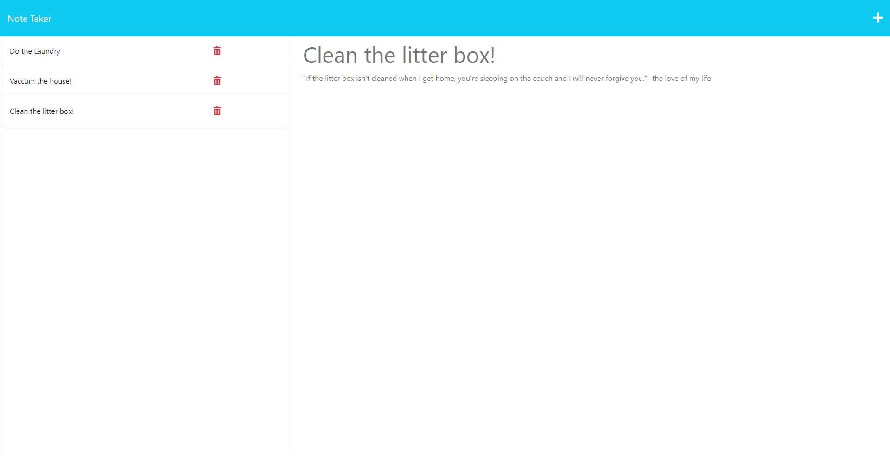

  # Taking-Some-Notes

  ### Licenses
  * License Badge: 
  * Link for license Badge: https://opensource.org/licenses/MIT

  ## TABLE OF CONTENTS
  * [Description](#description)
  * [Installation](#installation)
  * [Usage](#usage)
  * [Licenses](#licenses)
  * [Contribution](#contribution)
  * [Tests](#tests)
  * [Questions](#questions)
  * [Screenshot](#screenshot)
  * [Deployment](#deployment)

  ### Description
  A fun note taking application that the client can save, view, and delete notes.

  ### Installation
  Nothing, other than the 'npm install'

  ### Usage
  From the 'noteTaker' folder, enter 'node server.js'.

  ### Licenses
  MIT

  ### Contribution
  Feel free to fork the repository and add anything you think might work!

  ### Tests
  N/A

  ### Questions
  * Any questions? Visit the github repository here! https://github.com/Kenny4297/Taking-Some-Notes

  ### Screenshot
  * The following is a quick view of my project: 

  ### Deployment
  To view the deployed application, click here: [Deployment Site](https://taking-some-notes-production-b553.up.railway.app/)
